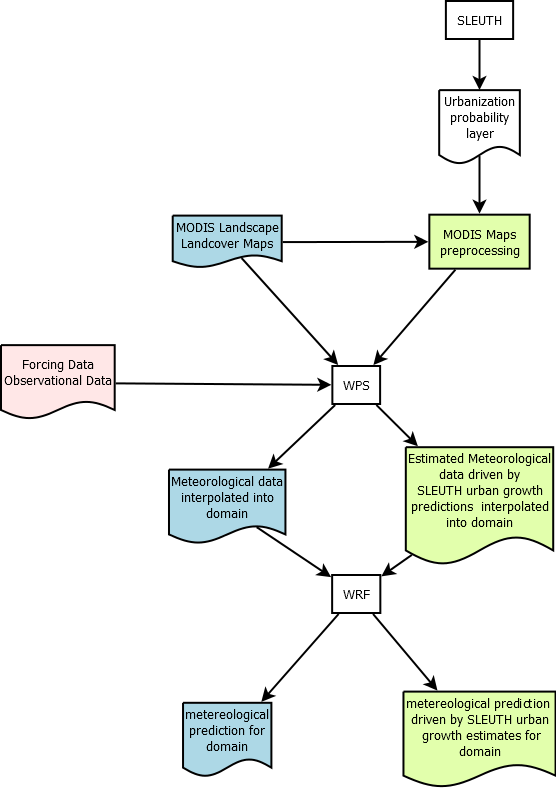

# Impacts of future urban growth on the distribution of rainfall in Mexico City Metropolitan Area

The objective of this study is to evaluate the effect of projected urban growth on the regional climate on Mexico City Metropolitan Area (MCMA). Wi will couple an urban growth model (SLEUTH) with a numerical weather prediction system (WRF) to spatially simulate the effect of projected urban growth scenarios on the distribution of rainfall within MCMA.

We will model two urban growth scenarios projected to 2050 (unrestricted and restricted-by-policy).

